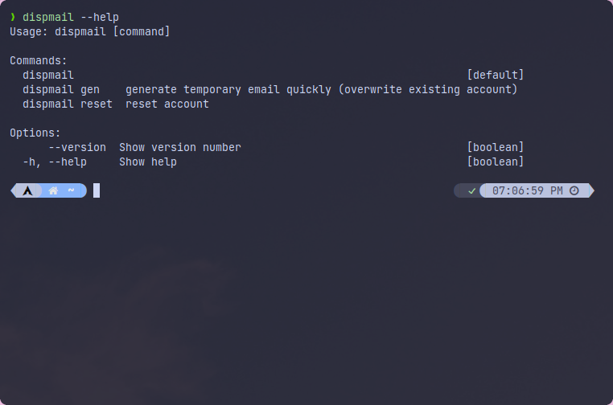
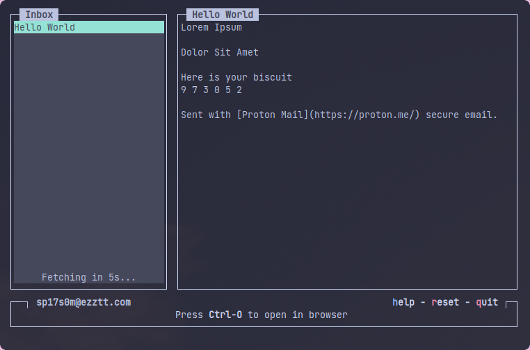

<h1 align="center">
  <br>

  <br>
  Dispmail
  <br>
</h1>
<h4 align="center">Generate temporary email from ur fav CLI</h4>
<p align="center">
    
  <br>
  <a href="https://www.npmjs.com/package/dispmail">
    
  </a>
  <a href="https://github.com/shinyxn/dispmail/releases/">
    
  </a>
    <a href="LICENSE">
    
  </a>
</p>

## Screenshot
### `Usage`


### `Main menu`


## Installation

Install the package globally using [npm](https://www.npmjs.com/package/dispmail) (Node Package Manager)

```
# npm install dispmail -g
```

or run via npx

```
$ npx dispmail
```

## Usage

Make sure the package has been installed globally, then you can start using the tools:

```
$ dispmail
```

### Shortcut commands

**Quicky generating random email**

_Note: This will be overwriting the current email account if any_

```
$ dispmail gen
```

**Reset account**

```
$ dispmail reset
```

## Acknowledgements

### API

Dispmail is using [1secmail](https://www.1secmail.com/api/) API for generating email

### License

This repo is under the [**MIT**](LICENSE) license

### Donation

If you like this project and want to support me, you can give me a pack of __indomie goreng rasa soto__ :)

<a href="https://coindrop.to/shinyxn" target="_blank"></img>

[](https://coindrop.to/shinyxn) [](https://coindrop.to/shinyxn)